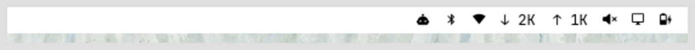
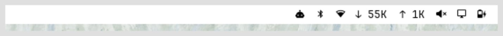
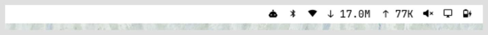

# netspeed

Live network throughput in the **Omarchy bar**: download and upload rate with a
down arrow for in, an up arrow for out. The **unit adapts** — `KB/s` for
everyday traffic, `MB/s` once a transfer really gets going — so a slow download
never just reads `0.0`. **No daemon**, no polling service — just a shell script
the bar already knows how to call.







The stock `omarchy.network` widget only shows a Wi-Fi/Ethernet icon; the live
rates it computes exist solely inside its pop-up, and only while that pop-up is
open. `netspeed` puts the rate in the bar itself, all the time.

## What it does

- Picks the **default-route interface** (the one carrying internet traffic).
- Reads its cumulative byte counters from `/sys/class/net/<iface>/statistics/`.
- Computes the rate against the **previous sample**, over the real elapsed
  time (a state file under `$XDG_RUNTIME_DIR`), so it stays accurate even if
  the bar's poll interval drifts.
- Picks the unit per direction: `0` below 1 KiB/s, `<n>K` (KB/s) below 1 MiB/s,
  `<n.n>M` (MB/s) above.
- Prints Waybar-style JSON: `{"text": "↓ 320K  ↑ 12K", "tooltip": "wlo1   ↓ 320K   ↑ 12K"}`.
- Offline (no default route): shows `↓ -- ↑ --`.
- Click the widget → opens the Omarchy network status.

## Requirements

- Omarchy (the Quickshell `omarchy-shell` bar).
- `jq` — used by the installer to edit `shell.json` (`omarchy pkg add jq`).
- `ip`, `awk`, `date`, `cat` — all base system.

## Install

From the repo root:

```bash
./install.sh netspeed
```

Or standalone:

```bash
./netspeed/install.sh
```

The installer:

1. copies `bin/netspeed` → `~/.config/omarchy/bar/scripts/netspeed` (mode 755);
2. adds a `netspeed` command widget to `bar.layout.right` in
   `~/.config/omarchy/shell.json`, right after `omarchy.network`.

It is **idempotent** (an existing `netspeed` entry is left alone) and copies
`shell.json` to `shell.json.bak.<epoch>` before touching it. The bar hot-reloads
on save; if the widget doesn't appear, run `omarchy restart shell`.

## How it works

`netspeed` is a **bar command module** — a built-in Omarchy mechanism
(`/usr/share/omarchy/shell/plugins/bar/README.md`). The bar runs the `exec`
command every `interval` seconds, takes the **last line** of stdout, parses it
as Waybar JSON, and renders `text` (plus `tooltip`). The entry in `shell.json`:

```json
{
  "id": "netspeed",
  "type": "command",
  "exec": "~/.config/omarchy/bar/scripts/netspeed",
  "interval": 2,
  "tooltip": "Network throughput",
  "onClick": "omarchy-network-status"
}
```

Rate math (see `bin/netspeed`): `rate = max(0, (bytes_now - bytes_prev) / dt)`
bytes/s, then formatted by the `fmt()` awk function (KiB / MiB / GiB
thresholds). The `max(0, …)` absorbs a counter reset or an interface switch;
the first sample after either shows `0` for one tick.

## Configuration

All knobs are one-line edits; the bar reloads on save.

| Want | Where | Change |
| --- | --- | --- |
| Faster/slower updates | `shell.json` entry | `"interval": 1` (min 1s) |
| Different arrows | `bin/netspeed` | swap `↓` / `↑` for Nerd Font `󰇚` / `󰕒` (the glyphs the network pop-up uses) |
| Always MB/s (no KB/s) | `bin/netspeed` | in `fmt()`, drop the `< 1048576` branch and use `%.2f` |
| Decimal K/M/G (10ⁿ) instead of binary (2ⁿ) | `bin/netspeed` | in `fmt()`, use `1000`, `1000000`, `1000000000` |
| More/less precision | `bin/netspeed` | change the `%.0f` / `%.1f` in `fmt()` |
| Move it in the bar | `shell.json` | reorder the entry, or `omarchy bar move netspeed --section right` |

After editing `bin/netspeed`, re-run the installer (or copy it over
`~/.config/omarchy/bar/scripts/netspeed` yourself).

## Files

| Path | Role |
| --- | --- |
| `~/.config/omarchy/bar/scripts/netspeed` | the script the bar runs |
| `~/.config/omarchy/shell.json` | holds the widget entry (backed up on install) |
| `$XDG_RUNTIME_DIR/omarchy-netspeed.state` | last sample (`iface ts rx tx`); transient |

## Uninstall

```bash
./netspeed/uninstall.sh
```

Removes the `netspeed` entry from `shell.json` (backup first), deletes the
script and the state file.

## Notes and limitations

- **K/M/G are binary** (1024-based), matching Omarchy's own `network/Model.js`.
  `K` is shown without decimals, `M`/`G` with one.
- **2 s trailing average.** The bar polls every `interval` seconds and shows the
  mean over that window, so bursty traffic (a package sync, an API client)
  reads low or `0` between bursts even while it's "active".
- **Counts everything on the default interface** — LAN, VPN and internet
  traffic all go through the same counters. There is no per-flow breakdown.
- **One idle tick on interface changes** (Wi-Fi ↔ Ethernet): the state resets
  and the next sample reads `0`.
- Omarchy's `Bar.qml` logs a harmless
  `TypeError: Cannot assign to read-only property "moduleName"` for *any*
  custom command module. It does not affect the widget.
