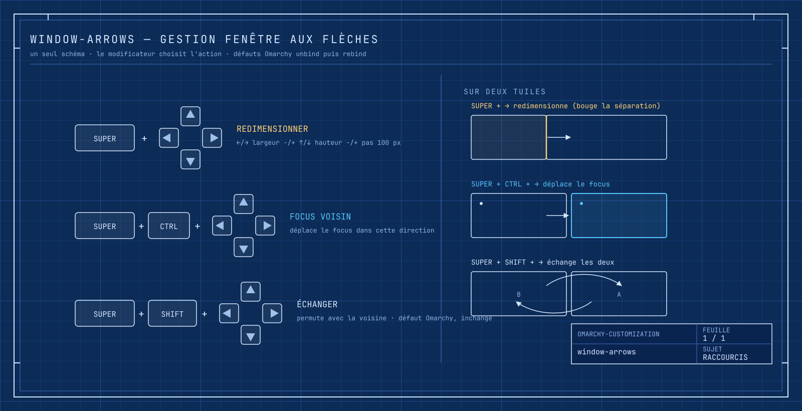

# window-arrows

Réaffecte les **flèches du clavier** à la gestion de fenêtre sous Hyprland /
Omarchy, autour d'un seul schéma cohérent :



| Raccourci | Action | Avant (défaut Omarchy) |
| --- | --- | --- |
| `SUPER + ←/→` | rétrécir / élargir la fenêtre | *Focus on left/right window* |
| `SUPER + ↑/↓` | raccourcir / agrandir la fenêtre | *Focus on above/below window* |
| `SUPER + CTRL + ←/→/↑/↓` | déplacer le focus vers la fenêtre voisine | *Move grouped window focus* (←/→ seulement) |
| `SUPER + SHIFT + ←/→/↑/↓` | **échanger** la fenêtre avec sa voisine | *Swap window* — **inchangé** |

Le déplacement de focus directionnel n'est pas perdu : il passe simplement de
`SUPER + flèches` à `SUPER + CTRL + flèches`.

## Comment ça marche

Le bloc ajouté à `~/.config/hypr/bindings.lua` `hl.unbind` les défauts puis
`o.bind` les nouvelles actions, avec les mêmes dispatchers Lua qu'Omarchy :

```lua
o.bind("SUPER + LEFT",  "Largeur -", hl.dsp.window.resize({ x = -100, y = 0, relative = true }))
o.bind("SUPER + CTRL + LEFT", "Focus fenetre gauche", hl.dsp.focus({ direction = "l" }))
```

`bindings.lua` est chargé après les défauts Omarchy (`require("hypr.bindings")`
dans `hyprland.lua`), donc les `hl.unbind` / `o.bind` du bloc l'emportent, et
sont rejoués à chaque `hyprctl reload`.

Le redimensionnement (`hl.dsp.window.resize`, pas relatif) agit sur le ratio de
la tuile : il ne fait rien sur une **fenêtre seule tuilée** (rien à quoi céder
la place) — il faut au moins deux fenêtres tuilées, ou une fenêtre flottante.
C'est le comportement standard de Hyprland, identique aux raccourcis de resize
d'Omarchy.

## Prérequis

- Omarchy / Hyprland (config Lua, `~/.config/hypr/bindings.lua`).
- `hyprctl` pour le rechargement (sinon `hyprctl reload` manuel plus tard).

## Installation

Depuis la racine du dépôt :

```bash
./install.sh window-arrows
```

ou en autonome : `./window-arrows/install.sh`.

L'installeur ajoute un bloc encadré par `-- >>> window-arrows` /
`-- <<< window-arrows` à la fin de `bindings.lua`, après une sauvegarde
`bindings.lua.bak.<epoch>`, puis `hyprctl reload`. **Idempotent** : si le bloc
est déjà là, il ne fait rien.

## Configuration

| Envie | Où | Changer |
| --- | --- | --- |
| Pas de redimensionnement plus grand / petit | bloc dans `bindings.lua` | `100` → `50` ou `200` dans les 4 `resize` |
| Inverser ←/→ (élargir à gauche) | bloc | permuter les signes `x` |
| Garder le focus sur `SUPER + flèches` | ne pas installer, ou éditer le bloc | — |

Après édition manuelle du bloc : `hyprctl reload`.

## Fichiers

| Chemin | Rôle |
| --- | --- |
| `~/.config/hypr/bindings.lua` | contient le bloc `window-arrows` (sauvegardé à l'install) |

## Désinstallation

```bash
./window-arrows/uninstall.sh
```

Retire le bloc (sauvegarde d'abord) et `hyprctl reload` : les défauts Omarchy
reviennent.
